# sc-tools

A collection of libraries that are helpful for building Cardano apps with Haskell. The main packages are:

* `convex-base`: Functions and types that are used by the other packages.
* `convex-node-client`: Some wrappers around the node client API from `cardano-api`
* `convex-wallet`: Minimal wallet implementation
* `convex-coin-selection`: Coin selection and transaction balancing
* `convex-mockchain`: Minimal mockchain for tests
* `convex-optics`: Some optics for plutus-ledger-api and cardano-api
* `convex-tx-mod`: Command-line tool for working with transactions

The API documentation (Haddocks) is published [here](https://j-mueller.github.io/sc-tools/)

### Dependencies

The `main` branch uses the following versions of its major dependencies:

|Name|Version|
|--|--|
|`cardano-node`|[10.1.1](https://github.com/IntersectMBO/cardano-node/releases/tag/10.1.1)|
|`cardano-api`|[10.1.0.0](https://chap.intersectmbo.org/package/cardano-api-10.1.0.0/)|
|`ghc`|9.6.6|
|`cabal`|3.10.3.0|

## Evaluating Transactions

The command-line tool `convex-tx-mod` can be used to download and analyse fully resolved transactions from blockfrost. Example:

```shell
export BLOCKFROST_TOKEN=<blockfrost_token>
convex-tx-mod download bba17fd7b99fd88e5cfffb3223cf3988367f5fa7371f6549474310b0453e4c0a -o tx.json
convex-tx-mod graph -f tx.json -o graph.dot
```

Note that the `BLOCKFROST_TOKEN` variable must be set to a token for the network that the transaction is from (ie mainnet, preprod).

This downloads the serialised transaction and all its inputs to `tx.json` and then generates a dot graph in `graph.dot`.

```dot
digraph "resolved-transactions" {
    graph [rankdir=LR];
    node [shape=record
         ,style=filled
         ,bgcolor=gray93
         ,height=0.1];
    txin_08705f19ca5f9aa702b13a54ad059c0b97dd39d05d91d10b2f01e24af01e3b0b_1 [label="0870...3b0b#1|script\ ea07...de6b|Ada:\ 939327.723740\nda8c...1d24.4c51:\ 171930652363\nf580...6b4c.4d5350:\ 1\nf580...6b4c.6263e0101384dace4d7a8dadf0e6d45c8d43c8872604118ee82e3f2212934917:\ 9223371653497800693\n"
                                                                            ,style=rounded];
    txin_0dc17712e37a4e741767db2f90d4ffbf69faf88b9bed4c47864f7bd912924bea_0 [label="0dc1...4bea#0|script\ f580...6b4c|Ada:\ 1.961050\nf580...6b4c.4d534753:\ 1\n"
                                                                            ,style=rounded];
    txin_2536194d2a976370a932174c10975493ab58fd7c16395d50e62b7c0e1949baea_0 [label="2536...baea#0|pubkey\ 0000...0000|Ada:\ 18.114930\n"
                                                                            ,style=rounded];
    txin_27901a20af0d603a779df0b805cc75154623c666294f8d6e3c1000253f39d7c8_2 [label="2790...d7c8#2|pubkey\ 5b7e...165b|Ada:\ 322.159130\n"
                                                                            ,style=rounded];
    txin_3359ada19f8b0af32d5f4aea95ea9d1b5642ed0b3041b4d5139a44af6d64d361_0 [label="3359...d361#0|script\ c3e2...7c4c|Ada:\ 3.300000\nda8c...1d24.4c51:\ 1513000000\n"
                                                                            ,style=rounded];
    txin_bba17fd7b99fd88e5cfffb3223cf3988367f5fa7371f6549474310b0453e4c0a_0 [label="bba1...4c0a#0|pubkey\ 9aeb...ff8f|Ada:\ 8114.192960\n"
                                                                            ,style=rounded];
    txin_bba17fd7b99fd88e5cfffb3223cf3988367f5fa7371f6549474310b0453e4c0a_1 [label="bba1...4c0a#1|script\ ea07...de6b|Ada:\ 931214.830780\nda8c...1d24.4c51:\ 173443652363\nf580...6b4c.4d5350:\ 1\nf580...6b4c.6263e0101384dace4d7a8dadf0e6d45c8d43c8872604118ee82e3f2212934917:\ 9223371653497800693\n"
                                                                            ,style=rounded];
    txin_bba17fd7b99fd88e5cfffb3223cf3988367f5fa7371f6549474310b0453e4c0a_2 [label="bba1...4c0a#2|pubkey\ 5b7e...165b|Ada:\ 323.493450\n"
                                                                            ,style=rounded];
    txin_cf4ecddde0d81f9ce8fcc881a85eb1f8ccdaf6807f03fea4cd02da896a621776_0 [label="cf4e...1776#0|pubkey\ 0000...0000|Ada:\ 12.486070\n"
                                                                            ,style=rounded];
    txin_d46bd227bd2cf93dedd22ae9b6d92d30140cf0d68b756f6608e38d680c61ad17_0 [label="d46b...ad17#0|pubkey\ 0000...0000|Ada:\ 68.429870\n"
                                                                            ,style=rounded];
    tx_bba17fd7b99fd88e5cfffb3223cf3988367f5fa7371f6549474310b0453e4c0a [label="Transaction|Fee:\ Ada:\ 0.665670|bba17fd7b99fd88e5cfffb3223cf3988367f5fa7371f6549474310b0453e4c0a|Withdrawal:\ stake17y02a946720zw6pw50upt2arvxsvvpvaghjtl054h0f0gjsfyjz59\ (Ada:\ 0.00)"];
    txin_08705f19ca5f9aa702b13a54ad059c0b97dd39d05d91d10b2f01e24af01e3b0b_1 -> tx_bba17fd7b99fd88e5cfffb3223cf3988367f5fa7371f6549474310b0453e4c0a [label=spend];
    txin_27901a20af0d603a779df0b805cc75154623c666294f8d6e3c1000253f39d7c8_2 -> tx_bba17fd7b99fd88e5cfffb3223cf3988367f5fa7371f6549474310b0453e4c0a [label=spend];
    txin_3359ada19f8b0af32d5f4aea95ea9d1b5642ed0b3041b4d5139a44af6d64d361_0 -> tx_bba17fd7b99fd88e5cfffb3223cf3988367f5fa7371f6549474310b0453e4c0a [label=spend];
    txin_0dc17712e37a4e741767db2f90d4ffbf69faf88b9bed4c47864f7bd912924bea_0 -> tx_bba17fd7b99fd88e5cfffb3223cf3988367f5fa7371f6549474310b0453e4c0a [label=reference];
    txin_2536194d2a976370a932174c10975493ab58fd7c16395d50e62b7c0e1949baea_0 -> tx_bba17fd7b99fd88e5cfffb3223cf3988367f5fa7371f6549474310b0453e4c0a [label=reference];
    txin_cf4ecddde0d81f9ce8fcc881a85eb1f8ccdaf6807f03fea4cd02da896a621776_0 -> tx_bba17fd7b99fd88e5cfffb3223cf3988367f5fa7371f6549474310b0453e4c0a [label=reference];
    txin_d46bd227bd2cf93dedd22ae9b6d92d30140cf0d68b756f6608e38d680c61ad17_0 -> tx_bba17fd7b99fd88e5cfffb3223cf3988367f5fa7371f6549474310b0453e4c0a [label=reference];
    txin_27901a20af0d603a779df0b805cc75154623c666294f8d6e3c1000253f39d7c8_2 -> tx_bba17fd7b99fd88e5cfffb3223cf3988367f5fa7371f6549474310b0453e4c0a [label=collateral];
    tx_bba17fd7b99fd88e5cfffb3223cf3988367f5fa7371f6549474310b0453e4c0a -> txin_bba17fd7b99fd88e5cfffb3223cf3988367f5fa7371f6549474310b0453e4c0a_0;
    tx_bba17fd7b99fd88e5cfffb3223cf3988367f5fa7371f6549474310b0453e4c0a -> txin_bba17fd7b99fd88e5cfffb3223cf3988367f5fa7371f6549474310b0453e4c0a_1;
    tx_bba17fd7b99fd88e5cfffb3223cf3988367f5fa7371f6549474310b0453e4c0a -> txin_bba17fd7b99fd88e5cfffb3223cf3988367f5fa7371f6549474310b0453e4c0a_2;
}
```



## Building transactions

We use the `TxBodyContent BuildTx BabbageEra` type from `cardano-api` as the basic type for building transactions. The `MonadBuildTx` class from `Convex.BuildTx` is essentially a writer for `TxBodyContent` modifications. `Convex.BuildTx` defines a number of helper functions for common tasks such as spending and creating Plutus script outputs, minting native assets, setting collateral, etc.

`Convex.CardanoApi.Lenses` defines some lenses for adding content to transaction bodies. These can be used together with `MonadBuildTx.addBtx`.

```haskell
import qualified Cardano.API.Shelley as C
import Convex.BuildTx (execBuildTx', payToAddress)

payTenAda :: Address BabbageEra -> TxBodyContent BuildTx BabbageEra
payTenAda addr = execBuildTx' (payToAddress addr (C.lovelaceToValue 10_000_000))
```

## Coin selection and transaction balancing

The task of converting a `TxBodyContent BuildTx BabbageEra` to a valid cardano transaction that can be submitted to the network is split up into three parts: Coin selection, transaction balancing, and signing. These all take place in the context of a wallet.

Coin selection is the act of adding inputs and outputs to the unfinished transaction body so that the overall balance of the transaction is in Ada only (no native assets) and strictly positive, ideally a couple of Ada.

Transaction balancing means setting the transaction fee to the correct amount that covers both Plutus script execution costs and the regular transaction fees.

To sign the transaction we use the wallet's private key to create a signature of the serialised transaction body and attach this signature to the transaction's list of key witnesses.

Coin selection and balancing is implemented in `Convex.CoinSelection`. The function `balanceForWallet` takes care of all three tasks and returns a fully balanced and signed transaction, as well a list the changes affected by the transaction on each address it touches:

```haskell
balanceForWallet :: (MonadBlockchain m, MonadFail m) => NodeParams -> Wallet -> UtxoState -> TxBodyContent BuildTx ERA -> m (C.Tx ERA, BalanceChanges)
```

Note the `MonadBlockchain` effect which is explained in the next section.

## Blockchain effects

Clearly, to use `sc-tools` in practice we need to be able to talk to the Cardano network at some point. These interactions are covered by the `MonadBlockchain` class:

```haskell
{-| Send transactions and resolve tx inputs.
-}
class Monad m => MonadBlockchain m where
  sendTx :: Tx BabbageEra -> m TxId -- ^ Submit a transaction to the network
  utxoByTxIn :: Set C.TxIn -> m (C.UTxO C.BabbageEra) -- ^ Resolve tx inputs
```

Both operations can be performed efficiently by a Cardano node using `cardano-api`.

## Testing

`sc-tools` includes a simple emulator that can be used to build and evaluate transactions. A simple unit test looks like this

```haskell
import qualified Cardano.Api.Shelley            as C
import qualified Convex.MockChain.CoinSelection as CoinSelection
import qualified Convex.MockChain.Defaults      as Defaults
import qualified Convex.Wallet                  as Wallet
import qualified Convex.Wallet.MockWallet       as Wallet

spendPublicKeyOutput :: Assertion
spendPublicKeyOutput = mockchainSucceeds $ do
  let tx = emptyTx & payToAddress (Wallet.addressInEra Defaults.networkId Wallet.w2) (C.lovelaceToValue 10_000_000)
  CoinSelection.balanceAndSubmit Wallet.w1 tx
```

See [src/coin-selection/test/Spec.hs](src/coin-selection/test/Spec.hs) for more details.

## Working with cardano node

The `node-client` package exposes a simple interface to some of node client functions from `cardano-api`. The main function is `foldClient`:

```haskell
foldClient ::
  forall s.
  s -> -- ^ Initial state
  Env -> -- ^ Node connection data
  (CatchingUp -> s -> BlockInMode CardanoMode -> IO (Maybe s)) -> -- ^ Fold
  PipelinedLedgerStateClient
```

With this you can write a node client that makes use of `cardano-node`'s parallel block fetching feature AND takes care of rollbacks for you, by rolling back to earlier states `s` if needed. You can use the `IO` effect to talk to the outside world and to update some shared state that is used by the rest of your app.

There is also a slightly more sophisticated version:

```haskell
{-| A variant of 'foldClient' with more detailed control over rollbacks.
-}
foldClient' ::
  forall s w.
  Monoid w =>
  s -> -- ^ Initial state
  Env -> -- ^ Node connection data
  (ChainPoint -> w -> s -> IO (w, s)) -> -- ^ Rollback
  (CatchingUp -> s -> BlockInMode CardanoMode -> IO (Maybe (w, s))) -> -- ^ Fold
  PipelinedLedgerStateClient
```

This lets you deal with rollbacks explicitly, by giving you a summary of type `w` of all the data that has been rolled back.

## Goals

The code in `sc-tools` has been written with the following goals in mind.

* Stick to `cardano-api` where possible, avoid defining additional types that duplicate those from `cardano-api` and `cardano-ledger`
* Provide an easy-to-use coin selection and balancing algorithm. It should be able to deal with Plutus scripts and native assets.
* Support off-chain code that fits in with the "fold of blocks"-style node client API from `cardano-api`.

## Credits & Attributions

`sc-tools` is based on my personal experience working with various apps and libraries in the Cardano Haskell space. There is nothing in this repository that is completely new:

* Much of the emulator code has been copied from `plutus-apps`
* The transaction balancing code is mostly copied from `cardano-api`, with some modifications that were suggested by Jean-Frederic Etienne and his work on the Djed stablecoin implementation
* The idea of having an extremely simple `MonadBlockchain` class, and an extremely simple emulator, comes from Tweag's `plutus-libs`. A big difference is that balancing is included as an effect in `cooked-validators`' `MonadBlockChain` class, whereas in `sc-tools` it is just a set of functions. This was done to decouple the wallet implementation from the blockchain code.
* The idea of having a little language for building transactions first appeared in `plutus-apps` where it was called "constraints". This was then refined by `cooked-validators`. In `sc-tools` we do away with the special types for constraints, and work on the `TxBody` type from `cardano-api` directly.
* Turning unfinished transactions into fully valid transactions was first implemented in `cardano-wallet`

What *is* new about this code is that it combines the above ideas in a codebase that adds as few abstractions as possible on top of `cardano-api`. So you don't need any dependencies other than `sc-tools` and `cardano-api` to write all of the off-chain code of your app.

## Robustness

There aren't a lot of tests right now, but I have used this code for real DeFi transactions on mainnet (trust me!)

## Contributing

Bug reports, pull requests and other contributions are welcome!
